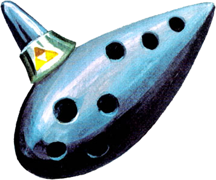

# Aniraco

> "The flow of time is always cruel: its speed seems different for each person, but no one can change it. A thing that does not change with time is a memory of younger days." -Sheik

## Available Songs

### [Song of Storms](https://www.youtube.com/watch?v=KeIVybmTgWg&t=2s)

### [Song of Healing](https://www.youtube.com/watch?v=WXnWfx6bIVE)

### [Song of Soaring](https://www.youtube.com/watch?v=IwdtnP3t3sA)

### [Song of Time](https://www.youtube.com/watch?v=ulwcsUAPfgc)

### [Inverted Song of Time](https://www.youtube.com/watch?v=qoo_YBlEl6g)

### [Song of Double Time](https://www.youtube.com/watch?v=bNvQv3u9ylE)

### [Saria's Song](https://www.youtube.com/watch?v=eJWupfLLP1Q)

### [Epona's Song](https://www.youtube.com/watch?v=sCRk0WDlreo)

### [Sun's Song](https://www.youtube.com/watch?v=OM-GSC1oqnE)

### [Zelda's Lullaby](https://www.youtube.com/watch?v=UpfYSyiyf2U)

## Contributing
You can find Zelda songs and sound effects in sound banks like [this one](http://noproblo.dayjo.org/ZeldaSounds/).

### Adding Songs
1. Add `.mp3` file to `src/sounds/songs` (rename to match style if needed).
2. Add song reference to `src/components/audio/Soundtrack.js`.
3. Add song keys to `matchSong()` in `public/main.js`.

  *  -> 119
  *  -> 97
  *  -> 115
  *  -> 100
  *  -> 103

_PRs that solve the song matching better are super welcomed!_

** Song matching caveat**: at this time, songs are limited to 6 keys. It's hardcoded at `playSong()` in `public/main.js`.

### Adding Instruments / Transformations
I thought of adding Link's transformations ([Zora](https://i.ytimg.com/vi/VSZqPV6lxsQ/hqdefault.jp), [Goron](https://vignette.wikia.nocookie.net/zelda/images/c/c9/Drums_of_Sleep.png/revision/latest?cb=20120405180821) and [Deku](https://i.ytimg.com/vi/QA3dhPwe9P8/hqdefault.jpg)) as "game modes" that you can change pressing a key. If you'd like to help with that, you'll need to:
* Propose an UI for showing modes
* Change `src/images/link.png` depending on the mode
* Load the new instrument:
  1. Make a directory in `src/sounds` with the instrument name in lowercase
  2. Add `.wav` files in a way similar to `src/sounds/ocarina`
  3. Change `Instrument`'s `name` value in `src/App.js` depending on the mode

## Credits
* Sound Effects: [Zelda Sounds by HTW](http://noproblo.dayjo.org/ZeldaSounds/)
* Images: [The Internet](http://images.google.com/)

---

[Zura Guerra](https://twitter.com/grafofilia) made this project in early 2017 as a fun way to learn React while messing a bit with the first tutorial of [Javascript30](https://javascript30.com/).

You can reach her at `zura@mazing.studio`.

---
## A Mazing project

Sponsored by [_Mazing Studio_](https://mazing.studio)

We love to solve problems using Go, Elixir and React.

Have a project you need help with? [Tell us about it!](https://mazing.studio/#section-form)
